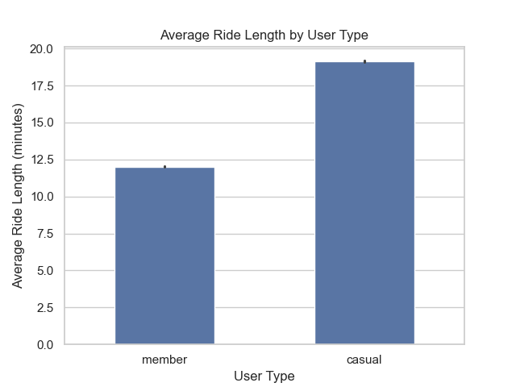
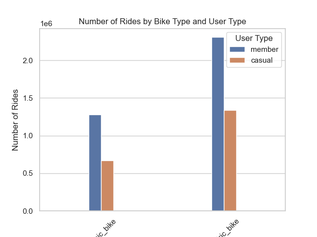
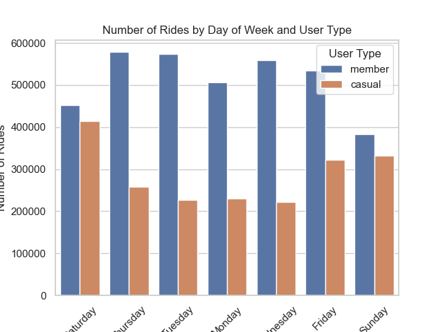
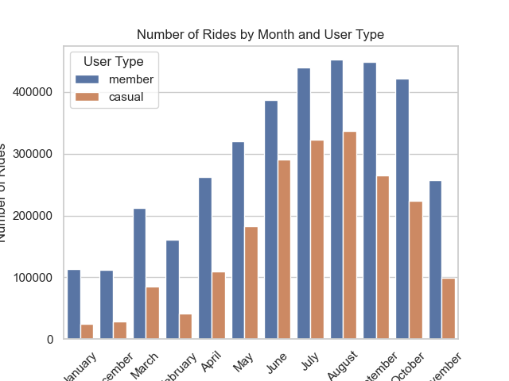

# Cyclistic Bike-Share Case Study

## Project Overview

This case study is part of the Google Data Analytics Certificate. The goal is to analyze how different types of customers use Cyclistic bike-share services and provide recommendations to increase annual memberships.

---

## Business Task

Cyclistic aims to maximize the number of annual memberships.
This analysis focuses on identifying behavioral differences between **casual riders** and **annual members**, and using these insights to develop strategies that convert casual users into members.

---

## Data Source

The data used for this analysis comes from Divvy Bike Share (Chicago), made available by Motivate International Inc.

* Public dataset: https://divvy-tripdata.s3.amazonaws.com/index.html
* Time period analyzed: Last 12 months of available data
* Data format: CSV files (monthly trip data)

---

## Tools & Technologies

* Python
* Pandas (data cleaning & manipulation)
* NumPy
* Matplotlib & Seaborn (data visualization)
* Jupyter Notebook

---

## Setup & Installation

To run this project locally, follow these steps:

1. Clone the repository:

```bash
git clone https://github.com/your-username/cyclistic-case-study.git
cd cyclistic-case-study
```

2. Install the required dependencies:

```bash
pip install -r requirements.txt
```

3. Launch Jupyter Notebook:

```bash
jupyter notebook
```

4. Open the notebook:

```
notebooks/cyclistic_analysis.ipynb
```

---

## Data Cleaning & Preparation

The following steps were performed:

* Combined 12 monthly datasets into a single dataframe
* Converted date columns (`started_at`, `ended_at`) to datetime format
* Created new features:

  * `ride_length` (trip duration in minutes)
  * `day_of_week`
  * `month`
* Removed invalid data:

  * Negative or zero ride durations
  * Outliers (rides longer than 24 hours)

---

## Exploratory Data Analysis

### Key Questions:

* How do ride durations differ between user types?
* How does usage vary by day of week?
* What seasonal trends exist?
* Are there differences in bike type usage?

---

## Key Insights

1. **Casual riders take longer trips than members**
   Casual users tend to use bikes for leisure and exploration.

2. **Members ride more frequently on weekdays**
   This suggests usage for commuting and routine travel.

3. **Casual riders are more active on weekends**
   Their behavior aligns with recreational use.

4. **Strong seasonal trends**
   Usage peaks in warmer months, especially among casual riders.

5. **Slight differences in bike preferences**
   Casual riders show a higher tendency to use electric bikes.

---

## Recommendations

1. **Weekend-focused promotions**
   Offer special weekend membership deals targeting casual riders.

2. **Promote commuting benefits**
   Highlight cost savings and convenience for daily riders.

3. **Seasonal marketing campaigns**
   Focus efforts during spring and summer when usage is highest.

4. **Conversion incentives**
   Provide rewards or discounts for frequent casual riders transitioning to membership.

---

## Visualizations









---

## Project Structure

```
cyclistic-case-study/
│
├── data/
├── notebooks/
├── visuals/
├── README.md
└── requirements.txt
```

---

## Conclusion

This analysis demonstrates clear behavioral differences between casual riders and members. By targeting casual users with tailored marketing strategies, Cyclistic can increase conversions and grow its membership base.

---

## Author

Oussama Manai
